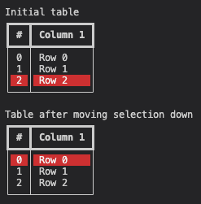
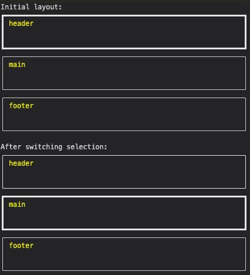
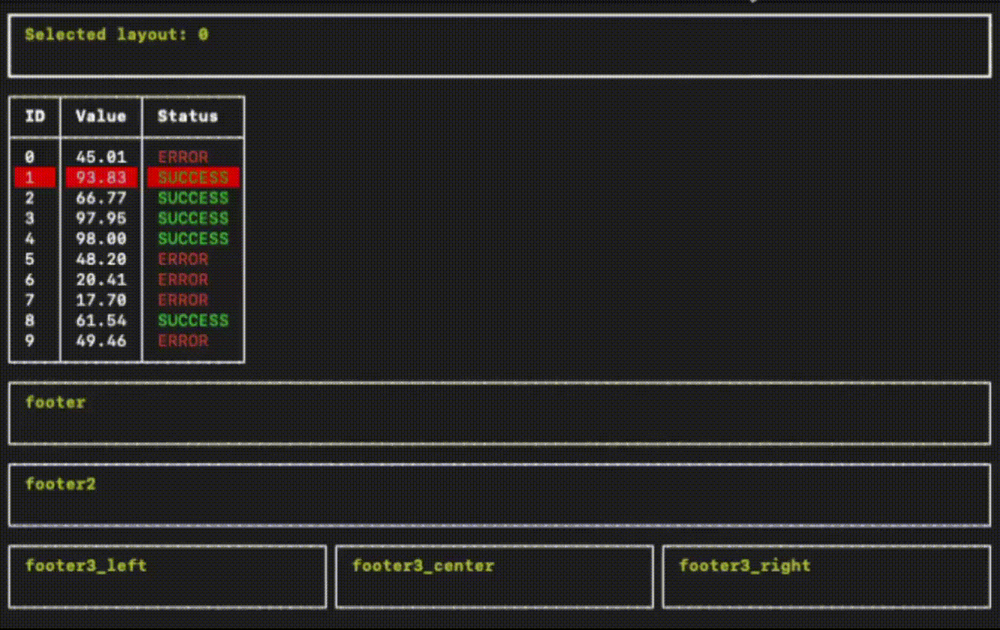

[](https://badge.fury.io/py/rich_interactive)

# Rich Interactive
Extends the [Rich](https://github.com/Textualize/rich) python library with interactive layouts and tables, allowing seamless navigation and interaction via keyboard shortcuts

## Installation

```bash
pip install rich_interactive
```

or using poetry

```bash
poetry add rich_interactive
```
## Interactive Tables

You can create interactive tables that can be easily navigated, and you can switch the selection to any of the rows.

```python
from rich import print
from rich.style import Style
from rich_interactive.interactive_table import InteractiveTable as Table

table = Table(
    selected_row=2,
    rotate_selection=True,
    selected_row_style=Style(bgcolor="red"),
)
table.add_column("#")
table.add_column("Column 1")

for row in range(3):
    table.add_row(f"{row}", f"Row {row}")

print("Initial table")
print(table)

table.move_selection_down()

print("Table after moving selection down")
print(table)
```

<!--  -->


## Interactive Layouts

You can create interactive layouts that can be easily navigated, and you can switch the selection to any of the children.

```python
from rich.console import Console
from rich.text import Text

from rich_interactive.interactive_panel import InteractivePanel as Panel
from rich_interactive.interactive_layout import InteractiveLayout as Layout


console = Console(width=60, height=15)

layout = Layout()
layout.split(
    Layout(name="header", size=5),
    Layout(name="main", size=5),
    Layout(name="footer", size=5),
)

for child in layout.children:
    child.update(Panel(Text(child.name, style="yellow")))

print("Initial layout:")
print(layout)

layout.switch_selection()

print("After switching selection:")
print(layout)

```

<!--  -->


# Future plans

My personal goal, is to prepare a good quality package, which would enable easy navigation with keyboard, like this:

<!--  -->


(Disclaimer: functionality shown in this gif is still in PoC stage, and it is not production ready yet)
